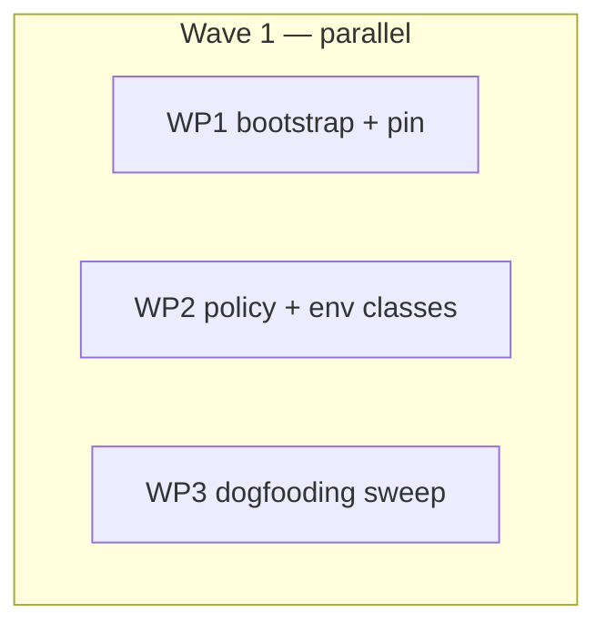

# Plan: Adopt ocx 0.6.0 — root-only `ocx.policy`, classified env, bootstrap parity

## Status

- State:   done
- Tier:    medium
- Updated: 2026-09-03
- Next:    (none — approved; /hex-finalize per owner /goal)
- Reviewed: 235c652 (2026-09-03 round 2 — Approve: 0 Block/High/Warn, converged 27/27; round 1 @ c359df7 was Needs Work)

---

## Overview

**Status:** Approved
**Author:** hex-plan (orchestrator: Fable session; owner-approved design; review panel applied)
**Date:** 2026-09-02
**Issue/Ticket:** N/A
**Related ADR:** `.agents/adr/adr_0001_policy-tag-and-env-classes.md`
**Related Research:** `.agents/research/research_bazel-policy-surfaces.md`
**Related Spec:** N/A

## Objective

Move rules_ocx from ocx 0.5.8 to 0.6.0 and, in the same release, make the
build's *weakening* posture (unverified installs, yanked releases) a function
of `MODULE.bazel` alone, while trust material stays site-authoritative unless
the root pins it in-tree: a root-only `ocx.policy` tag, one classified env-var table, `--no-verify` on the one
command that takes it, the three new sysexits mapped, the sigstore trusted-root
tier watched, the lazy launcher re-entering `ocx exec`, and the self-verifying
dist manifest the official installers already honour.

## Scope

### In Scope

- Pin bump 0.5.8 → 0.6.0 (`scripts/bump_ocx.py --version 0.6.0`; 0.6.0 is live
  upstream with 8 stable rows, verified 2026-09-02).
- `ocx.policy(allow_unverified, allow_yanked, sigstore_trusted_root)` root-only
  tag class, threaded into every project/package repo.
- `OCX_ENV_CLASSES` table replacing the four loose env structures.
- `--no-verify` on `package install` when allowed; `OCX_NO_VERIFY` and
  `OCX_ALLOW_YANKED` pinned from attrs; `OCX_NO_PROJECT` pinned `1`;
  `OCX_SIGSTORE_TRUSTED_ROOT` translucent (attr label, staged as a runfile for
  lazy launchers).
- Sysexit hints 83/84/85. `$OCX_HOME/sigstore/trusted-root.json` watched
  outside the `no_config` gate.
- Lazy project launcher `"run"` → `"exec"`; 0.6.0 floor in `ocx_download`.
- Self-verifying `dist/<sha256>.json` manifest when `OCX_INSTALL_DIST_URL`
  names one.
- Dogfooding sweep (`ocx run` → `ocx exec`; `ocx self setup --hook` documented
  next to `direnv allow`), AGENTS.md contract update,
  `.claude/rules/mirror-auth.md` committed, `OCX-CLI-RENAME-HANDOVER.md`
  removed (its claim that rule/attr names mirror CLI verbs is false; its
  floor and breaking-release demands are adopted here).

### Out of Scope

- Any signature verification, sigstore, TUF or Rekor logic in Starlark
  (invariant 1). `OCX_INSTALL_CA_BUNDLE` (no `ctx.download` cacert parameter —
  documented gap). *Implementing* mirror auth (the gap is documented in
  `.claude/rules/mirror-auth.md`, which WP3 commits). Attrs for
  `OCX_INSTALL_DIST_URL`/`OCX_INSTALL_MIRROR_URL` — site knobs, env-only by the
  class model; the installers expose exactly these variables (ADR). A rules_ocx
  release (`release.md`, separate). Starlark-side tar guards (only a
  sha256-pinned archive is ever extracted). Deleting `.envrc` — `ocx direnv
  export` is not deprecated in 0.6.0.
- `OCX_SIGNING_KEY`, `OCX_KEY_PASSWORD`, `OCX_IDENTITY_TOKEN`, `OCX_NO_HOOK`,
  `OCX_CONSENT_*`, `OCX_LOG/COLOR/FORMAT`, `OCX_UPDATE_CHECK_INTERVAL` — ignored
  by design. `OCX_CEILING_PATH` — dead once `OCX_NO_PROJECT=1` is pinned (its
  only reader is the project CWD walk).
- A per-tag policy override (hybrid) and auto-retry of 83 — deferred to the
  owner (ADR § Deferred); both additive later.

## Research

**Research artifact:** `.agents/research/research_bazel-policy-surfaces.md`

Root-only tag classes via `module.is_root` are the established bzlmod pattern;
rules_ocx keeps its `fail()`-on-non-root convention. Attr-over-`getenv`
translucency is already idiomatic. `ctx.download(sha256=)` verifies the body,
uses the repository cache, and an empty string equals omitting the kwarg.
`bazel_skylib` `versions.is_at_least(threshold, version)` (equal passes) covers
the floor; skylib is already a dependency. No ruleset pipes sigstore
verification into a fetch-time rule — delegating to the CLI is the right call.

## Technical Approach

### Architecture Changes

```
MODULE.bazel
  ocx.policy(allow_unverified, allow_yanked, sigstore_trusted_root)   [root only, ≤1]
        │  resolve_policy()  (pure; returns error string, extension fail()s)
        ▼
  _ocx_impl ──┬─► ocx_project_repo(**POLICY_ATTRS)
              └─► ocx_package_repo(**POLICY_ATTRS)      (hub gets none)
                        │
                        ▼  make_ocx_env()  — OCX_ENV_CLASSES, one table
        explicit    (2)  OCX_NO_VERIFY, OCX_ALLOW_YANKED           from attrs, ambient ignored
        translucent (4)  OCX_CONFIG, OCX_PATCH_SNAPSHOT,
                         OCX_SIGSTORE_TRUSTED_ROOT, OCX_NO_CONFIG  attr, else ambient (+watch)
        site        (10) OCX_MIRRORS … OCX_PATCHES                 ambient, getenv-tracked
        pinned      (5)  OCX_PROJECT "", OCX_GLOBAL "0", OCX_QUIET "0",
                         OCX_NO_PROJECT "1", OCX_NO_CONFIG_REFRESH "1"
                        │
                        ├─► eager: package install carries --no-verify when allowed
                        └─► lazy:  launcher re-exports policy pair + pinned rows (minus OCX_QUIET)
  ocx.download(version ≥ 0.6.0)  → ctx.download(dist_url, sha256 = manifest_sha256(dist_url))
```

### Key Decisions

| Decision | Rationale |
|----------|-----------|
| New root-only `ocx.policy` tag (not attrs on `download`, not per-tag attrs) | Names the concern; root owns the graph's trust posture incl. dependencies' `ocx.package` tags. ADR §Options A–C. |
| Weakening knobs explicit-only; ambient `OCX_ALLOW_YANKED`/`OCX_NO_VERIFY` never read (BREAKING) | An exported CI variable must not silently decide verification. ADR §Options D–E. |
| Attr named `allow_unverified` (default False), not `verify` (default True) | rules_ocx cannot enable verification, only refuse to disable it; the name states what is true and pairs with `allow_yanked`. Deletes the `invert` row. |
| `--no-verify` only on `package install` | The project-tier `ocx pull` takes no such flag in 0.6.0 (`crates/ocx_cli/src/command/pull.rs`); its posture is governed by the pinned `OCX_NO_VERIFY` via `Context::try_init`. |
| Non-root `ocx.policy` → `fail()` (not silent-ignore) | Matches sibling tags (`extensions.bzl:200,218`); loud beats quiet for policy. |
| Host config tiers stay default and first-class; attrs are the Bazel-inline alternative | Fleet distribution = managed config packages; remote executors running lazy launchers have no `OCX_HOME`, so the label→runfile route exists. |
| `OCX_NO_PROJECT` pinned `"1"`; `OCX_CEILING_PATH` row dropped | `OCX_NO_PROJECT=1` prunes the env var and CWD walk but never the explicit `--project` flag (`crates/ocx_lib/src/config/loader.rs:600-634`), so the project tier is unaffected and the package tier stops walking from the fetch or action directory. With the walk closed, the ceiling has no reader. |
| Trust root watched by a separate `sigstore_trust_root_path(home, is_windows)`, outside the `no_config` gate; `ambient_config_paths()` not renamed | With `no_config` + a `config` label carrying `[[trust.policy]]`, ocx still reads rung 4; Bazel must invalidate on it. (ADR resolved Q1/Q3.) |
| `no_config = True` disabling verification is documented, not warned | Defaults are the safe ones; a warning would fire for every existing `no_config` user. (ADR resolved Q2.) |
| `OCX_NO_CONFIG` classified translucent | It already has an attr (`no_config`) that overrides ambient. Forwarded count stays 14. |
| Mirror knobs stay env-only; no `dist_url`/`mirror_url` attrs | Site settings by the class model; installer parity; removes two one-way-door names and the only cross-WP file coupling. |
| `bazel_skylib` `versions.is_at_least(MIN_OCX_VERSION, version)` for the floor | Already a dependency; argument order is (threshold, version). |
| `.envrc` kept; docs add `ocx self setup --hook` | `ocx direnv export` is not deprecated in 0.6.0; the prompt hook is the 0.6.0 way, offered alongside. |
| Lazy launchers export pinned + explicit rows and *staged* translucent labels only; an unset translucent attr is deliberately not exported | The executor's site environment then decides (`OCX_SIGSTORE_TRUSTED_ROOT`, `OCX_MIRRORS`, …) — host/site config is authoritative by design unless the root pins material in-tree. Only the weakening knobs are sealed. |

## Component Contracts

Full text with edge cases: architect deliverable (session scratch); the
summaries below are the coverage keys. Fragments in **bold** are guard-test
constants (`.claude/rules/starlark.md`).

- **C-001** `OCX_ENV_CLASSES` (`repo_utils.bzl`) — one insertion-ordered dict keyed by env var, rows from `_env(cls, attr = "", path = False, value = "", hermetic = False)`. Classes: `site` (10: OCX_MIRRORS, OCX_INSECURE_REGISTRIES, OCX_OFFLINE, OCX_FROZEN, OCX_REMOTE, OCX_JOBS, OCX_INDEX, OCX_DEFAULT_REGISTRY, OCX_MANAGED_CONFIG, OCX_PATCHES[hermetic]); `translucent` (4: OCX_CONFIG[config,path,hermetic], OCX_PATCH_SNAPSHOT[patch_snapshot,path,hermetic], OCX_SIGSTORE_TRUSTED_ROOT[sigstore_trusted_root,path], OCX_NO_CONFIG[no_config]); `explicit` (2: OCX_NO_VERIFY[allow_unverified], OCX_ALLOW_YANKED[allow_yanked]); `pinned` (5: OCX_PROJECT "", OCX_GLOBAL "0", OCX_QUIET "0", OCX_NO_PROJECT "1", OCX_NO_CONFIG_REFRESH "1"). Replaces `OCX_PASSTHROUGH_ENV`, `_OCX_NEUTRALIZED_ENV`, the inline attr pair list and `no_config`'s blank set. Invariants: getenv set = site ∪ translucent, size 14; OCX_ALLOW_YANKED/OCX_NO_VERIFY absent from it; every translucent/explicit row names an attr in `CONFIG_ATTRS | POLICY_ATTRS`; only translucent rows set `path`; only pinned rows set `value`; OCX_HOME in no class.
- **C-002** `policy_exports(allow_unverified, allow_yanked)` — pure; returns `{"OCX_NO_VERIFY": "1" if allow_unverified else "0", "OCX_ALLOW_YANKED": "1" if allow_yanked else "0"}`; both keys always present (that presence is the neutralization).
- **C-003** `make_ocx_env(ctx, host, isolated_home)` — signature/return unchanged. Order: resolve OCX_HOME (existing guard **`OCX_HOME must be absolute`**); pinned rows; forward site+translucent ambient; watch surviving translucent path rows (no attr override, not blanked, absolute); blank hermetic rows under `no_config`; apply translucent attrs (bool → "1" only when true, label → `str(ctx.path(label))`); apply `policy_exports`; watch `ambient_config_paths(...)` only when config is not pruned (existing gate) and `sigstore_trust_root_path(home, is_windows)` **unconditionally** when it returns a path. OCX_SIGSTORE_TRUSTED_ROOT survives `no_config` and its ambient absolute value is still watched.
- **C-004** `POLICY_ATTRS` (next to `CONFIG_ATTRS`) — `allow_unverified` bool False, `allow_yanked` bool False, `sigstore_trusted_root` label `allow_single_file = True`. Splatted by `ocx_project_repo` and `ocx_package_repo` as `CONFIG_ATTRS | POLICY_ATTRS | {…}`; hub gets none. Attr docs: `allow_unverified` says rules_ocx cannot enable verification (ocx attaches it only under an operator `[[trust.policy]]`) and that `no_config` prunes the discovered tier carrying it; `sigstore_trusted_root` carries the "copied into the repository, uploaded with every action" note; `isolated_home` docs (both tags, both rules) gain "relocates `OCX_HOME`, so ocx's `~/.ocx/sigstore/trusted-root.json` rung is not found there — with a trust policy, resolution falls through to the Rekor cache and TUF and can fail offline".
- **C-005** `resolve_policy(instances)` — pure reducer (`resolve_platforms` precedent). Input list of `struct(module, is_root, allow_unverified, allow_yanked, sigstore_trusted_root)`; output `struct(error, allow_unverified, allow_yanked, sigstore_trusted_root)`. Empty → defaults, `error = ""`. First non-root → `POLICY_NON_ROOT_MSG` (**`may only be used by the root module`**, names the module). Second root instance → `POLICY_DUPLICATE_MSG` (**`at most one ocx.policy() tag`**).
- **C-006** `_policy` tag class + `_ocx_impl` threading (`extensions.bzl`) — key `"policy"`, attrs mirror C-004 with docs; impl collects instances over all modules (`mod.tags.policy` aggregates every `use_extension` of that module), calls `resolve_policy`, `fail(error)` before declaring any repo, passes the triple to every `ocx_project_repo`/`ocx_package_repo` incl. per-platform repos. No os/getenv/download (invariant 3).
- **C-007** `install_args(json_pkg, platform_arg, allow_unverified, pkg)` (`package.bzl`, pure, `pinned_ref` precedent) → `json_pkg + ["install"] + platform_arg + (["--no-verify"] if allow_unverified else []) + [pkg]`; `pull_args(project, target, groups)` (`project.bzl`, pure) → `project + ["pull"] + target + EAGER_LAZY_MODE + (["-g", ",".join(groups)] if groups else [])` — **no** verify flag anywhere else (`pull`, `env`, `package which`, `package env`, both `inspect --closure` take none in 0.6.0). `_ocx_project_repo_impl` / `_ocx_package_repo_impl` call the builders.
- **C-008** `SYSEXIT_HINTS` + 83 (**`transparency log is unreachable`**: retry / check Rekor network / `ocx.policy(allow_unverified = True)`), 84 (**`does not support the OCI Referrers API`**: names registry or OCX_MIRRORS + opt-out), 85 (**`signing key backend`**: operator `[trust]` config + DEFAULT_OCX_VERSION). `_RETRYABLE` unchanged; 82 stays absent; invariant 4's 82 sentence unchanged (`ocx config setup`/`ocx self setup` are not renamed in 0.6.0).
- **C-009** `sigstore_trust_root_path(home, is_windows)` (`repo_utils.bzl`) — returns `<home>` + sep + `sigstore` + sep + `trusted-root.json` (sep = `\\` when `is_windows`, else `/`, mirroring `ambient_config_paths`) when `home` is truthy, else `None` (so `isolated_home` drops it). `ambient_config_paths()` unchanged. Consumers: `make_ocx_env` (watched outside the `no_config` gate), tests, `starlark.md` carve-out (names both helpers and the `dist/<sha256>.json` convention), `update-dist` skill re-verify list (this path + the www-setup `dist_pin_digest` convention).
- **C-010** `stage_lazy_config(ctx, is_windows)` — `exports` gains `policy_exports(...)` unconditionally; staged loop gains `(ctx.attr.sigstore_trusted_root, "trusted-root.json", "OCX_SIGSTORE_TRUSTED_ROOT")`, appended to `data` as `":trusted-root.json"`; hermetic blank list read off C-001 (trust root not blanked). With `sigstore_trusted_root = None` the key is **absent** from `exports` — the action environment decides, by design (Key Decisions).
- **C-011** `render_lazy_launcher(command, is_windows, exports)` — **replaces** the hard-coded `OCX_PROJECT`/`OCX_GLOBAL` lines (`:954-965`) with every C-001 pinned row except OCX_QUIET (named skip constant), in table order, before caller exports: OCX_PROJECT, OCX_GLOBAL, OCX_NO_PROJECT, OCX_NO_CONFIG_REFRESH; POSIX `export K="V"`, Batch `set "K=V"`. Each emitted exactly once.
- **C-012** floor — `versions.bzl` gains `MIN_OCX_VERSION = "0.6.0"` and `min_version_error(version)` (`versions.is_at_least(MIN_OCX_VERSION, version)`), returns `""` or `MIN_OCX_VERSION_MSG` (**`requires ocx 0.6.0 or newer`**, names `ocx exec` and `--no-verify`, and both fixes). `_ocx_download_impl` calls it first and `fail()`s before any download. Invariant: `min_version_error(DEFAULT_OCX_VERSION) == ""` — the shipped pin always satisfies the floor (test stays red until the pin bump lands, then guards any rollback).
- **C-013** *(withdrawn — mirror knobs stay env-only; see Key Decisions)*.
- **C-014** `manifest_sha256(url)` (`manifest.bzl`) — last path segment (cut at `#`, then `?`, then last `/`); return the leading 64 chars when the segment is exactly 69 chars, ends with `.json`, and chars 0–63 ∈ `0123456789abcdef`; else `""`. `_ocx_download_impl` passes it as `sha256` to `ctx.download(dist_url, "dist.json")` (an empty string equals omitting the kwarg). Uppercase not accepted. Parity: www-setup `dist_pin_digest` (`src/install.sh:497-518`).
- **C-015** `lazy_project_command(binary, toml, groups, name)` (`project.bzl`, pure) — returns the argv list `[binary, "--project", toml, "exec"] + groups + ["--", name]`. Every argument arrives **already quoted per OS by the caller** (`_lazy_project` keeps today's `'"{}"'` / `sh_quote` quoting and the Batch `bat_value` refusal, `project.bzl:55-63`); the builder quotes nothing. `_lazy_project` calls it for both arms (replacing `project.bzl:66,72`). Docstrings in `project.bzl` (module, `_lazy_project`, `bins` attr, rule doc) and the `ocx.project` tag `bins` doc say `ocx exec`.
- **C-016** pin bump + generated docs + AGENTS.md — `python3 scripts/bump_ocx.py --version 0.6.0` moves `DEFAULT_OCX_VERSION`, `dist/dist.json`, CI setup-ocx pins together; `bazel run //docs:update` after every docstring change. AGENTS.md: contract header → "verified against 0.6.0" only after the live examples pass (they exercise all four parsed JSON shapes); sysexit line + 83/84/85; env list −OCX_ALLOW_YANKED +OCX_SIGSTORE_TRUSTED_ROOT (still 14) and the explicit/pinned classes named; tag-class list + `policy`; lazy-mode seven-command list `run` → `exec`; invariant 5 adds `ocx shell allow/revoke/state` (new 0.6.0 group next to `self setup`) to the never-run list; floor + `run`→`exec` stated; trust root gets its **own** bullet (not in the config-precedence ladder); Dogfooding: `ocx self setup --hook` or `direnv allow`, `ocx exec -- <cmd>`.
- **C-017** dogfooding surfaces — in WP3's files only, every `ocx run` reads `ocx exec` (taskfile.yml, taskfiles/release.taskfile.yml, README.md, examples/project/MODULE.bazel, examples/project/tools_test.sh); CONTRIBUTING.md and README.md mention `ocx self setup --hook` alongside `direnv allow`; `.claude/rules/mirror-auth.md` committed with the www-setup corroboration + CA-bundle gap. Acceptance: `grep -n 'ocx run' taskfile.yml taskfiles/release.taskfile.yml README.md CONTRIBUTING.md examples/project/MODULE.bazel examples/project/tools_test.sh` → zero hits.

## User-Experience Scenarios

| ID | Action | Expected outcome | Error cases |
|---|---|---|---|
| S-001 | Root sets no `ocx.policy` | Defaults: verification not disabled, yanked refused, ambient OCX_NO_VERIFY/OCX_ALLOW_YANKED shadowed; no message | none |
| S-002 | Root sets `ocx.policy(allow_unverified = True)` | `package install` carries `--no-verify`; every ocx call sees `OCX_NO_VERIFY=1`; lazy launchers export the pair | none (reviewable choice) |
| S-003 | A dependency declares `ocx.policy` | Extension fails before any repo is declared; message names the module + `may only be used by the root module` | — |
| S-004 | Root declares two `ocx.policy` tags (incl. across dev/non-dev usages) | `at most one ocx.policy() tag` | — |
| S-005 | CI exports `OCX_NO_VERIFY=1`, root sets nothing | Every ocx call sees `OCX_NO_VERIFY=0`; not on the getenv set, so no invalidation | — |
| S-006 | Operator `[[trust.policy]]` present, Rekor down | `pull` exits 83 with `transparency log is unreachable` + three routes; no auto-retry | — |
| S-007 | Registry lacks Referrers API | `package install` exits 84 `does not support the OCI Referrers API`, names mirror knob + opt-out; distinct from 79 | — |
| S-008 | `ocx.download(version = "0.5.8")` | Fails before download: `requires ocx 0.6.0 or newer`, both reasons, both fixes | — |
| S-009 | `OCX_INSTALL_DIST_URL=https://mirror/dist/<64hex>.json` | Manifest body fetched with that sha256 enforced (repository cache hit skips network); any other name → unverified as today | sha256 mismatch → Bazel download error |
| S-010 | Remote executor runs a lazy `bins` launcher with a committed `sigstore_trusted_root` | Root staged as `trusted-root.json` runfile; launcher exports `OCX_SIGSTORE_TRUSTED_ROOT` via `$(rlocation …)`, the policy pair and the four pinned vars | missing runfile → the launcher assigns, exports, then checks each staged path is non-empty and exits 74 with a message (rlocation returns 0 with empty output when a manifest exists, so `set -e` alone cannot catch it; corrected 2026-09-03 after the WP2 security review) |

## Parallelization

<!-- `Verify` column per hex-core protocol.md § Parallel-by-default decomposition (deliberate extension of the local template). -->

| WP | Scope | Expected Files | Size | Wave | Depends on | Review | Verify | Status |
|----|-------|----------------|------|------|------------|--------|--------|--------|
| WP1 bootstrap + pin | C-012, C-014, C-016 (bump, CI pins, shape proof), S-008, S-009 | `ocx/private/download.bzl`, `ocx/private/manifest.bzl`, `ocx/private/versions.bzl`, `ocx/tests/manifest_test.bzl`, `dist/dist.json`, `.github/workflows/ci.yml`, `.github/workflows/release.yml` | M | 1 | — | panel | full | merged |
| WP2 policy + env classes | C-001…C-011, C-015, C-016 (AGENTS.md, rules, skill, docstrings), S-001…S-007, S-010 | `ocx/private/repo_utils.bzl`, `ocx/private/project.bzl`, `ocx/private/package.bzl`, `ocx/extensions.bzl`, `ocx/tests/launcher_test.bzl`, `ocx/tests/policy_test.bzl` (new), `ocx/tests/BUILD.bazel`, `examples/package/MODULE.bazel`, `AGENTS.md`, `.claude/rules/starlark.md`, `.claude/skills/update-dist/SKILL.md` | L | 1 | — | panel | full | merged |
| WP3 dogfooding sweep | C-017 | `taskfile.yml`, `taskfiles/release.taskfile.yml`, `README.md`, `CONTRIBUTING.md`, `examples/project/MODULE.bazel`, `examples/project/tools_test.sh`, `.claude/rules/mirror-auth.md` (committed at the frozen base; WP3 appends) | S | 1 | — | self | scoped | merged |



**Critical path:** WP2 alone (largest WP; no dependency edges).

**Shippable after wave:** 1 — the whole plan is one wave.

**Merge order:** WP1, WP3, WP2 — serialized onto `hex/ocx-0-6-0-adoption`.
After **each** merge the orchestrator runs `bazel run //docs:update` in the
main checkout (stardoc cannot build in a fresh worktree on this host —
`hex.md › Memory`) and commits the regenerated `docs/*.md` on the feature
branch before the merge gate runs, so `//docs:...` diff_tests are green.
`Verify: full` on WP1 (pin change nothing textually references) and on WP2
(changes env defaults every ocx call sees). The final gate runs `task verify`
(lint + unit + live examples) plus the `update-dist` skill's fresh-fetch proof.

**Parallelization justification:** WP3 is below the overhead floor but stays
isolated: file-disjoint, zero-risk mechanical churn that would otherwise dilute
the two security-reviewed diffs, run on a `self` budget on the cheaper model.

**Untracked-file note:** `.claude/rules/mirror-auth.md` was committed as-is in
the plan commit (frozen base); WP3 appends to it. `OCX-CLI-RENAME-HANDOVER.md`
was untracked and removed from the main checkout at execution start.

## Implementation Steps

> **Contract-first TDD:** Stub → Specify → Implement → Review-Fix per WP.
> Guard tests hold their expected fragment in a constant the call site cannot
> spell and are proven red once (`.claude/rules/starlark.md`).

### WP1 — bootstrap + pin

**Phase 1 Stub**
- [x] **1.1** `ocx/private/versions.bzl`: add `MIN_OCX_VERSION = "0.6.0"`, `MIN_OCX_VERSION_MSG`, `min_version_error(version)` stub returning `""` (Starlark has no "unimplemented"; the stub returns the permissive value so tests go red). Public API: `min_version_error(version) -> str`.
- [x] **1.2** `ocx/private/manifest.bzl`: `manifest_sha256(url)` stub returning `""`. Public API: `manifest_sha256(url) -> str`.
- Gate: `bazel build //...` and `bazel test //ocx/tests:manifest_tests` still pass.

**Phase 2 Architecture Review** — `reviewer` focus `spec`, phase `post-stub`: surfaces match C-012/C-014.

**Phase 3 Specify** (`ocx/tests/manifest_test.bzl`; `versions.bzl` is visible to `//ocx/tests`)
- [x] **3.1** `min_version_error`: `"0.5.8"` → contains `requires ocx 0.6.0 or newer`; `"0.6.0"`, `"0.7.1"` → `""`; `min_version_error(DEFAULT_OCX_VERSION) == ""` (red until step 4.3). Covers C-012, S-008.
- [x] **3.2** `manifest_sha256`: valid 69-char name → digest; 63/65-char, uppercase, `.txt`, `https://h/dist.json` → `""`; `?query` and `#frag` after a valid name → digest. Covers C-014, S-009.
- Gate: 3.1–3.2 fail against the stubs.

**Phase 4 Implement**
- [x] **4.1** Fill `min_version_error` via `load("@bazel_skylib//lib:versions.bzl", "versions")`, argument order `(MIN_OCX_VERSION, version)`; call it first in `_ocx_download_impl` and `fail()` on non-empty. Rule doc names the floor.
- [x] **4.2** Fill `manifest_sha256`; pass its result as `sha256 =` to the `ctx.download(dist_url, "dist.json")` call (download.bzl:33). Docstring names the www-setup `dist/<sha256>.json` convention.
- [x] **4.3** Pin bump: `python3 scripts/bump_ocx.py --version 0.6.0` (rewrites `versions.bzl` pin, `dist/dist.json`, CI setup-ocx pins). In the same two workflow files replace every `ocx run` with `ocx exec` (ci.yml:32,62,189,191,195; release.yml:40). If the script reports an archive-format NOTE, act per the `update-dist` skill.
- [x] **4.4** Shape proof (Covers: C-016): `task test:examples` (live registry) green against the pinned 0.6.0 — this exercises `env`, `package install`, `package which`, `inspect --closure` parsing; then the fresh-fetch proof `ocx exec -- bazelisk --output_base=/tmp/ocx-fresh test //ocx/tests:ocx_tool_test --repository_cache=/tmp/ocx-emptycache --test_output=all` prints 0.6.0.
- Gate: `bazel test //...` green (docs regenerated at merge by the orchestrator); `task lint` green (includes `dist:check`, `bump_ocx_test.py`).

**Phase 5 Review** — panel (spec post-implementation, quality, security: download path, URL-segment parsing, sha256 handling).

### WP2 — policy + env classes

**Phase 1 Stub**
- [x] **1.1** `ocx/private/repo_utils.bzl`: `_env()` row constructor and `OCX_ENV_CLASSES` per C-001 (old constants kept as derived views until 4.1); `POLICY_ATTRS` (C-004); `policy_exports()` stub returning the *wrong* fixed values; `resolve_policy()` returning defaults with `error = ""`; `POLICY_NON_ROOT_MSG`/`POLICY_DUPLICATE_MSG`; `sigstore_trust_root_path(home, is_windows)` stub returning `None`; 83/84/85 keys in `SYSEXIT_HINTS` with placeholder text. Extend the `_env_ctx` fake in `ocx/tests/launcher_test.bzl:111` with `allow_unverified`, `allow_yanked`, `sigstore_trusted_root` attr parameters (defaults matching C-004) so existing callers keep working.
- [x] **1.2** `project.bzl`: splat `POLICY_ATTRS`; add pure `pull_args(project, target, groups)` and `lazy_project_command(binary, toml, groups, name)` stubs that reproduce today's argv (still `"run"`). `package.bzl`: splat `POLICY_ATTRS`; add pure `install_args(json_pkg, platform_arg, allow_unverified, pkg)` stub that ignores `allow_unverified`. Call the builders from the impls.
- [x] **1.3** `ocx/extensions.bzl`: `_policy` tag class (C-006) registered as `"policy"`; `_ocx_impl` collects instances, calls `resolve_policy`, threads the triple into every project/package repo call.
- Gate: `bazel build //...`, existing `bazel test //ocx/tests/...` green except `_passthrough_env_test_impl` and `_sysexit_hints_test_impl`, which the derived constants redden by design until 3.1/3.6 update them (post-stub review, 2026-09-02).

**Phase 2 Architecture Review** — `reviewer` focus `spec`, phase `post-stub`: surfaces match C-001…C-011, C-015.

**Phase 3 Specify** (`ocx/tests/launcher_test.bzl` for repo_utils behaviour; new `ocx/tests/policy_test.bzl` for `resolve_policy`, `policy_exports`, `install_args`, `pull_args`, `lazy_project_command`, the `OCX_ENV_CLASSES` table invariants; register in `ocx/tests/BUILD.bazel`)
- [x] **3.1** Table test: class ∈ four; getenv set = site ∪ translucent, size 14, excludes OCX_ALLOW_YANKED/OCX_NO_VERIFY; translucent/explicit attrs ∈ `CONFIG_ATTRS | POLICY_ATTRS`; only translucent set `path`; only pinned set `value`; OCX_HOME absent. Update `_passthrough_env_test_impl` (`launcher_test.bzl:249`) accordingly. Covers C-001, C-004.
- [x] **3.2** `policy_exports`: four combinations → exact dicts. Covers C-002.
- [x] **3.3** `make_ocx_env` via `_env_ctx` (`:111`/`:164` template): fully-populated ambient incl. OCX_NO_VERIFY=1, OCX_ALLOW_YANKED=1, OCX_NO_PROJECT=0 → env has OCX_NO_VERIFY "0", OCX_ALLOW_YANKED "0", OCX_NO_PROJECT "1"; `allow_unverified = True` → "1"; `no_config` blanks the three hermetic keys, OCX_SIGSTORE_TRUSTED_ROOT survives and its absolute ambient value is watched; the home trust-root path is watched even under `no_config`; label attr → `str(ctx.path(...))`. Covers C-003, C-009, S-001, S-002, S-005.
- [x] **3.4** `resolve_policy`: empty; one root (values threaded); one non-root → `POLICY_NON_ROOT_MSG` fragment + module name; two root → `POLICY_DUPLICATE_MSG` fragment. Covers C-005, C-006, S-003, S-004.
- [x] **3.5** `install_args(..., allow_unverified = True/False, ...)` → `--no-verify` present exactly at the C-007 slot / absent; `pull_args(...)` never contains `--verify` or `--no-verify`; `-g` placement preserved. Covers C-007.
- [x] **3.6** `_DOCUMENTED_SYSEXITS` → `[64,65,69,74,75,77,78,79,80,81,83,84,85]`, both-directions + 82-absent assertions; guard cases for the three fragments via `_GUARD_CASES` (`:928`) using `_replay_ctx` exit codes 83/84/85. Covers C-008, S-006, S-007.
- [x] **3.7** `sigstore_trust_root_path`: (`/home/u/.ocx`, False) → `/home/u/.ocx/sigstore/trusted-root.json`; (`C:\\Users\\u\\.ocx`, True) → backslash-joined; (`""`, either) → `None`. `ambient_config_paths` fixtures (`:1005-1068`) unchanged. Covers C-009.
- [x] **3.8** `stage_lazy_config`: no attrs → exports exactly the two policy keys; ambient `OCX_SIGSTORE_TRUSTED_ROOT` set in the fake ctx + attr `None` → key absent from `exports` (site decides at action time — the translucent contract in lazy mode); `sigstore_trusted_root` set → `exports["OCX_SIGSTORE_TRUSTED_ROOT"] == "$(rlocation test_repo/trusted-root.json)"` (POSIX) and `":trusted-root.json"` in data; `no_config` does not blank it. Covers C-010, S-010.
- [x] **3.9** `render_lazy_launcher`: POSIX fixture has the four pinned exports in table order before `exec`, each exactly once, OCX_QUIET absent; Batch fixture `set "K=V"`. `lazy_project_command(...)` output (pre-quoted inputs for each arm) contains `"exec"` and not `"run"` (tests at `:621`/`:657` switch from hand-written argv to the builder). Covers C-011, C-015.
- Gate: every new/changed test fails against the stubs; guard tests proven red.

**Phase 4 Implement**
- [x] **4.1** `make_ocx_env` rewritten onto `OCX_ENV_CLASSES` (C-003); delete the three old constants and the inline pair list; `stage_lazy_config` (C-010); `render_lazy_launcher` (C-011, replacing not appending); `sigstore_trust_root_path` (C-009); real hint text for 83/84/85 (C-008); `resolve_policy`, `policy_exports` real bodies.
- [x] **4.2** `project.bzl`: `pull_args` final, `lazy_project_command` emits `"exec"` (C-015), docstrings (module :6, `_lazy_project` :35, `bins` :207/:225/:231, lazy comment :116). `package.bzl`: `install_args` honours `allow_unverified` (C-007). `extensions.bzl`: attr docs per C-004 (allow_unverified/no_config caveat; trusted-root upload note; `isolated_home` rung-4 note at :65/:139 and on both rules, `project.bzl:237` / `package.bzl:316`), `ocx.project` `bins` doc :44 `run` → `exec`.
- [x] **4.3** `repo_utils.bzl` comments :63, :146, :405 `ocx run` → `ocx exec`; :40 "0.5.8's" wording.
- [x] **4.4** AGENTS.md per C-016 (lines 43-49 invariants, 59 header, 83-85 lazy list, 115-119 sysexits, 121-124 config precedence unchanged + new trust-root bullet, 135-141 env list/classes, 158-163 Dogfooding). `.claude/rules/starlark.md:16-18`: carve-out names `ambient_config_paths()`, `sigstore_trust_root_path()` and the `dist/<sha256>.json` convention (`manifest_sha256`). `.claude/skills/update-dist/SKILL.md:104` `ocx exec`; `:158-163` add the sigstore path and the www-setup `dist_pin_digest` convention to the re-verify list.
- [x] **4.5** `examples/package/MODULE.bazel`: add `ocx.policy()` with defaults so `task test:examples` exercises the tag class, `resolve_policy` and the attr threading against the live registry (S-001 end-to-end). Hostile-ambient assertions stay unit-level (3.3, 3.8) — AGENTS.md keeps the policy tier unit-covered beyond this smoke fixture.
- Gate: `bazel test //ocx/tests/...` green; `buildifier` clean.

**Phase 5 Review** — panel (spec post-implementation with C-/S- traceability; quality; security: env neutralization completeness, argv builders, launcher exports quoting via existing `sh_quote`/`bat_value`).

### WP3 — dogfooding sweep

**Phase 1 Stub** — none (docs/config only).

**Phase 3 Specify**
- [x] **3.1** Acceptance grep (C-017): `grep -n 'ocx run' taskfile.yml taskfiles/release.taskfile.yml README.md CONTRIBUTING.md examples/project/MODULE.bazel examples/project/tools_test.sh` returns zero after the change. Pre-change hits (measured 2026-09-02): taskfile.yml 5, release.taskfile.yml 3, README.md 2, examples 2, CONTRIBUTING.md 0.

**Phase 4 Implement**
- [x] **4.1** `taskfile.yml:8,26,27,28,40`, `taskfiles/release.taskfile.yml:39,41,55`: `ocx run --` → `ocx exec --`.
- [x] **4.2** `README.md:154,203` prose `ocx run` → `ocx exec`. `CONTRIBUTING.md:27`: "`ocx self setup --hook` (0.6.0 prompt hook, once per shell) or `direnv allow` gives you bazelisk, …; or prefix with `ocx exec --`". `.envrc` untouched.
- [x] **4.3** `examples/project/MODULE.bazel:22`, `examples/project/tools_test.sh:7`: `ocx run` → `ocx exec` in comments/prose.
- [x] **4.4** Append to `.claude/rules/mirror-auth.md`: "Corroborated 2026-09-02 against www-setup: the five official installers send no credentials on the install path either; `OCX_INSTALL_CA_BUNDLE` (curl `--cacert`) has no `ctx.download` equivalent and is a documented gap."
- Gate: acceptance grep zero; `task lint` green (lychee on README links).

**Phase 5 Review** — `self` (builder self-check). Branch-level `/hex-review` is mandatory before landing because this plan contains a `self` WP.

### Cross-cutting (orchestrator, at merge time)
- [x] After each WP merge: `bazel run //docs:update` in the main checkout; commit `docs/*.md` on the feature branch; then the merge gate.
- [x] At execution start: `rm -f OCX-CLI-RENAME-HANDOVER.md` in the main checkout — owner-approved 2026-09-02 (analysis action list item 7); the file was read in full, is untracked (no git history lost), and its one verified claim (no rule/attr named `run`) is recorded in WP2's commit body.
- [x] Final gate: `task verify`; fresh-fetch proof from the `update-dist` skill; commit subjects: WP1 `feat(ocx)!: adopt ocx 0.6.0 — floor and self-verifying dist manifest`, WP2 `feat(ocx)!: root-only ocx.policy and classified env passthrough` with a `BREAKING CHANGE:` footer naming `OCX_ALLOW_YANKED` and the 0.6.0 floor, WP3 `chore: ocx run → ocx exec, document the 0.6.0 prompt hook`. WP2's body notes the handover document's rule-name premise was false while its floor and breaking-release demands are adopted. *(branch commits carry no `!`; the marker and the `BREAKING CHANGE:` footer land in the finalize squash commit — hex-review round 1/2)*

## Dependencies

### Code Dependencies

| Package | Version | Purpose |
|---------|---------|---------|
| bazel_skylib | 1.9.0 (present, non-dev dep) | `versions.is_at_least` for the floor |
| ocx CLI | 0.6.0 (live upstream, 8 stable rows) | pinned binary |

### Service Dependencies

| Service | Status | Notes |
|---------|--------|-------|
| https://setup.ocx.sh/dist.json | Available | `bump_ocx.py` refreshes from it |
| ocx.sh registry | Available | `task test:examples` (live) |

## Rollback Plan

1. Revert the feature branch merge; `dist/dist.json` is additive so reverting the pin alone (`versions.bzl` + CI pins) also works.
2. A consumer stuck on 0.5.x pins an older rules_ocx release (the floor message says so).

## Risks

| Risk | Mitigation |
|------|------------|
| `OCX_ALLOW_YANKED` operators break on upgrade | BREAKING footer + changelog; one-line `ocx.policy(allow_yanked = True)` fix named in the message |
| Trusted-root watch path relocated upstream (fails open) | Joins the `update-dist` re-verify list (C-009) |
| Self-verifying manifest fails open on other names | Artifact sha256 in the manifest stays the boundary; convention named in `starlark.md` + skill |
| `task verify` needs the live registry | Same as today; run from the main checkout |
| Stardoc cannot run in worktrees on this host | Orchestrator regenerates docs at merge (hex.md Memory) |

## Checklist

### Before Starting
- [x] ADR accepted (`adr_0001`)
- [x] Dependencies available (0.6.0 live; skylib present)
- [x] Feature branch `hex/ocx-0-6-0-adoption` created from `main`

### Before PR
- [x] `task verify` green; docs regenerated; guard tests seen red once
- [ ] Branch-level `/hex-review` run (mandatory: WP3 is `self`)

### Before Merge
- [ ] Owner review; no push by agents — owner's `/goal` (2026-09-03) authorizes `/hex-finalize` push + ff into main + release; recorded here, not ticked

## Notes

- rules_ocx cannot *enable* verification: ocx attaches it only under an
  operator `[[trust.policy]]`. `ocx.policy` refuses to disable it. Attr docs say so.
- `OCX_AUTH_<REGISTRY>_*` remains un-enumerable; `bazel fetch --force` after a
  credential change stays the documented answer.
- WP1 review triage (2026-09-02): security low "malformed version bypasses the floor via skylib's dev-build sentinel" fixed with a digit-shape check (quality medium too); `ocx/private/BUILD.bazel` gained `@bazel_skylib//lib:versions` as a bzl_library dep outside the owned set (stardoc needs it); docstrings no longer promise a `dist/` parent (only the last segment is checked) nor call the artifact sha256 a boundary on the unverified-manifest path.
- WP2 review triage (2026-09-03): launcher exports split + non-empty guard (security high); Batch arm via `bat_value()`; translucent loop folded; `--no-verify` kept per C-007 (quality queried it as redundant with OCX_NO_VERIFY — spec decision); the `ctx.watch()`-rejects-directories premise was wrong (Bazel 8.7 watches either), so no watch guard was added; AGENTS.md re-verified: 85 is `UnsupportedKeyBackend`, 84 is write-path only in 0.6.0 (hint kept per C-008, documented as unreachable — owner may drop it), 83/85 reach us via `pull`, `env`, `package install`, `package env`; prompt hook needs `ocx self setup --hook` then `ocx shell allow`; trust root has a config-tier rung that `no_config` prunes.
- Adversary triage (2026-09-03, codex code-diff): **high** — ocx 0.6.0 `pull`/`exec` record a shell-activation consent stamp unconditionally (no env/flag/TTY gate; verified at v0.6.0); no mitigation exists short of `isolated_home`, so it is documented in AGENTS.md invariant 5 and README, upstream request filed as [ocx-sh/ocx#400](https://github.com/ocx-sh/ocx/issues/400) (`OCX_NO_CONSENT` → one pinned row once it lands). **medium** ambient `OCX_SIGSTORE_TRUSTED_ROOT` overclaim → ADR impact row and README/AGENTS.md residual clause corrected (class stays translucent by design). **low** `binaries_complete` type-checked; relative ambient translucent paths refused (`RELATIVE_ENV_PATH_MSG`); Windows `/etc` rationale corrected. Rejected: Codex Batch `if defined` claim (per-line parse).
- hex-review round 1 (2026-09-03, branch scope @ c359df7): Needs Work — no Block; High: breaking-change marker (resolved by the finalize squash message), floor doc on the `ocx.download()` tag, README mirror-table caveat, consent note for lazy `exec`, policy triple threading untested (→ `policy_kwargs()`); C-017's literal `ocx run` grep missed `ocx --project … run --` (taskfile.yml:51), repaired by 4f8cd30; convergence: Converged; Codex adversary pass (2 pre-existing lows deferred).
- hex-review round 2 (2026-09-03, delta c359df7..235c652): Approve — all round-1 items resolved; round-2 Warns (third call site, `file://` carve-out scope, stale drift prose, `no_config` caveat, README wording) fixed in 235c652 and verified; Fold-Back not performed (no `## Spec Deltas`). Deferred to owner: C-007 `--no-verify` redundancy, 84 hint kept, `file://` trusted root stays unwatched (fail-open), Batch command quoting and unwatched OCX_INDEX contents (pre-existing).

## Schedule log

<!-- append-only; one line per merge onto the feature branch -->
- 2026-09-02T20:43:49Z · merged WP3 @ 1753aabfd1ff1375ab3b6f48af1cd79795c1735d · verify scoped [6s] · ready: WP1, WP2 · blocked: —
- 2026-09-02T21:09:29Z · merged WP1 @ 1d9ab0a8f8cac5c46965b4be03c0b27f3447969f · verify full (lint, 64 unit, 3 examples) · ready: WP2 · blocked: —
- 2026-09-02T22:11:10Z · merged WP2 @ dbd8f3d1545a513d92e4ce52174f1abadbdd7bd3 · verify full (lint, 74 unit, 3 examples) · ready: — · blocked: —
